
<b>NLP Analysis of Boulder employers reviews</b>

  

## Business Problem

Many companies struggle with analyzing answers to open-ended questions in their employees' surveys.
While multiple-choice questions are straight-forward, they only anticipate answers that a surveyor
wrote into the survey with a few predetermined responses. Multiple-choice questions are limited
in a way that allows manipulating data by forcing a survey taker into specific categories of answers.
Open-ended questions allow a person to describe an issue in their own words, highlighting their 
concerns and opinions and providing additional details that otherwise might be missed. 
However, open-ended questions provide a challenge for survey processors, especially in a situation 
with a large volume of answers.

The Natural Language Processing approach is a logical approach to that problem. The goals of this project are 
    
1. Develop a predictive classification model of employer reviews from INDEED.com job search site. 
2. Gain insight into factors affecting satisfaction or dissatisfaction of people with their employer.

  

## Data Description

The data for this project has been obtained by scrapping INDEED job search site (https://www.indeed.com/companies/search?q=&l=80301&from=discovery-cmp). The search was limited to the 50 most popular companies in Boulder, CO area. INDEED limits the number of companies returned by a query (50). Some of these companies do not have any reviews; therefore, the final list of employers is: 
1.	Ball Aerospace
2.	University of Colorado Boulder
3.	Boulder Valley School District
4.	Boulder Community Health
5.	Boulder County CO
6.	Splunk
7.	Naropa University
8.	Amazon
9.	Brookdale Senior Living
10.	IBM
11.	NETA
12.	Apple
13.	City of Boulder CO
14.	Medtronic
15.	Emerson
16.	NetApp
17.	Zayo Group
18.	Whole Foods Market
19.	Particle Measuring Systems
20.	Boulder Medical Center
21.	Sage Hospitality
22.	University of Colorado
23.	Mental Health Partners
24.	Agilent Technologies
25.	Frasier Meadows
26.	Cozymeal
27.	IHS Markit
28.	National Renewable Energy Laboratory
29.	University Corporation for Atmospheric Research
30.	Sprouts Farmers Market
31.	KPMG
32.	New Relic
33.	Excelitas Technologies
34.	Northrop Grumman
35.	KBI Biopharma
36.	Ricoh
37.	Embassy Suites by Hilton
38.	U.S. Department of Commerce
39.	InVitae
40.	Pfizer
41.	SUEZ
42.	PetSmart
43.	Craft Health
44.	Imagine!
45.	King Soopers
46.	Safeway  

Almost 44% of the reviews belong to Amazon's former and current employees.

Reviews of the companies are from all US states where the companies have operations. Not limiting reviews to the Boulder area only was made because the number of reviews from the limited geographic area is small and would affect a predictive ability of statistical models.
The original dataset has 12620 records with four columns:
  
    1.Company name 
    2.Unique review identifier 
    3.Rating (on the scale between 1 and 5) 
    4.Review text 
    
The original Rating scale has been changed to the 1-3 range to simplify the analysis. 1 corresponds to Negative reviews, 2-to Neutral reviews, and 3-to Positive reviews. Reviews with the original ratings 1 and 2 were lumped into the Negative category, reviews with the original rating 3 became the Neutral review category, and reviews with the original rating 4 and 5 were combined into a Positive review category.  
The names of the companies were removed from the text of the reviews to make analysis non-company specific   

# EDA

> Exploratory Data Analysis shows how overwhelmingly present Amazon reviews are in the dataset. In fact, Amazon reviews represent 44% of the total number of reviews
  
#### Distribution of Reviews

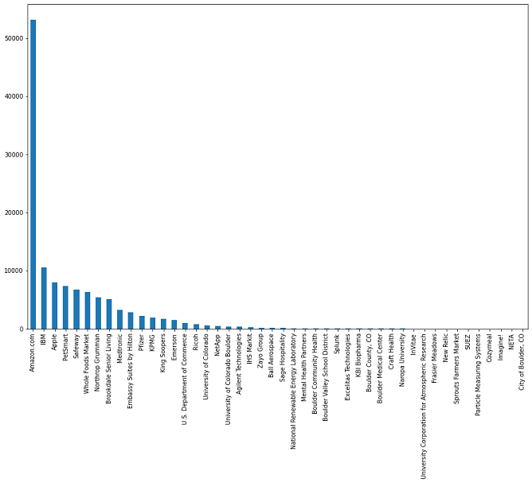

  

> While Amazon reviews represent a big part of the overall corpus of the review, the split between the classes within Amazon chunk and the rest of the reviews is not that much different. The plot below shows that the percentage of positive reviews of Amazon is 3.5% lower than in all other employer reviews. It is not a very significant difference, but it's worth noting.
 
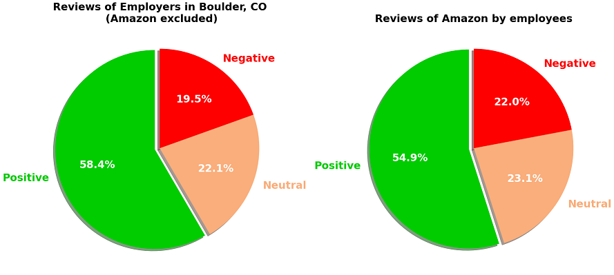

  
> The plot above shows that most employers in the area have more positive reviews than negative ones, with a few outliers mostly among small employers with very few reviews (less than 50).
 
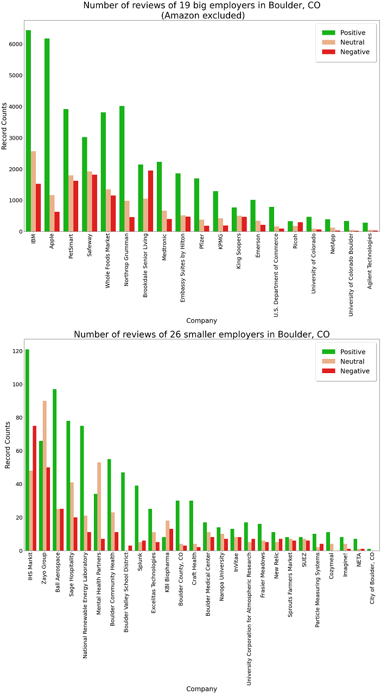

     

### Venn diagrams of negative, positive and neutral reviews unique word subsets

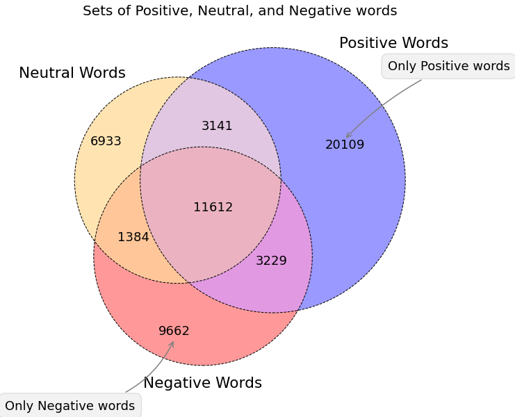

> The Venn diagram shows a significant overlap between negative, positive, and neutral word subsets. Given the numbers, it is fair to expect that Positive reviews will be most easily identifiable, while Neutral reviews will be most challenging to identify.

  

### Word Clouds of negative, positive and neutral reviews:
 

> The workclouds are just visualization tools and do not represent the importance of the words for statistical models. However, they signify the frequency of the words used in a particular context. In this case, it's the frequency of the words used in negative, positive, and neutral reviews. The wordclouds above show that the most frequent words used in the negative and neutral reviews are 'employee' and 'manager,' while in positive reviews, words are more diverse. I will perform a similar assessment after the modeling part.

!
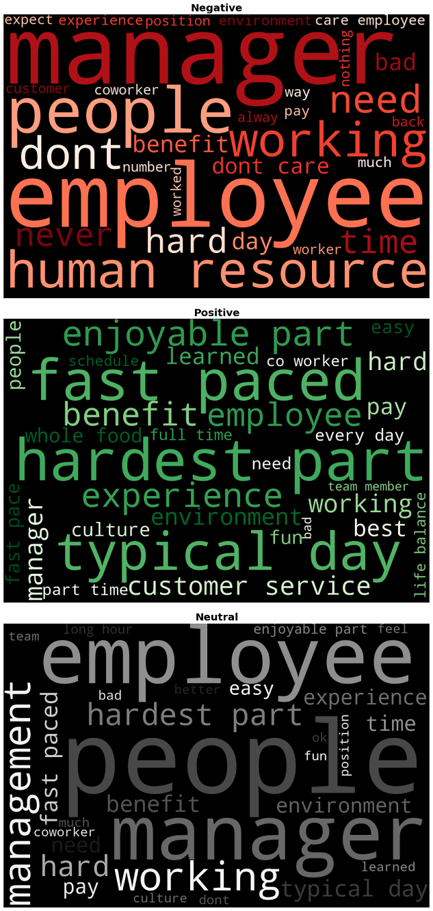

  

## Pre-processing

### Tokenization with Lemmatization
 

> I tested several tokenizers (RegExpTokenizer,TreebankWordTokenizer and my own Tokenizer class) in conjunction with WordNetLemmatizer. RegExpTokenizer/WordNetLemmatizer combination generated the best results in terms of minimizing the number of unique tokens and computational time. Stop_words set was customized (please see details in the code)

 

### Vectorization
 

> Two vectorized datasets were generated. One was using CountVectorizer and the other one - TfIdfVectorizer. Each of the datasets contained 46962 feature columns

  

# Modeling
 

## Models
> Several classifiers were tested: MultinomialNBClassifier, XGBoostClassifier and LogisticRegressionCVClassifier. As the first step I tested them with default hyperparameters and then ran a gridsearch for each of the models. 

None of the models with default hyperparameters performed remarkably well:
* MultinomialNB model with CountVectoried dataset was very fast but performed slightly worse than LogisticRegression models (both count-vectorized and tdidf-vectorized) in terms of accuracy
* MultinomialNB model has the best ability to identify Neutral reviews, which seems to be a problem for other models.
* Logistic regression models took the most time to train but produced better results.
* MultinomialNB model does not have many parameters to tune the model except the alpha smoothing parameter
* Logistic regression can be tuned up on many more parameters, but the time running each variation might become prohibitive.
* XGBClassifier models (both count-vectorized and tdidf-vectorized) performed slightly worse than MultinomialNB model. However, XGBCalssifier has more hyperparameters to tune it and therefore might be a good candidate for a grid search considering the relatively short time to run the fit.
  

> Gridsearch results:

The best performing models are 

* LogRegressionCV model with TfIdfVectorizerwith best gridsearch hyperparameters 
* MNBClassifier model with CountVectorizer with best gridsearch hyperparameters
* Both models use the same full features dataset

  

> Reduction of Features, addition of bigrams

By omitting words that are used in more than 99% of the reviews and in less than 1% of the reviews and adding bigrams to the features the number of the dimentions was reduced to 406 features

1.  The best MNB model with 406 features is much less over-fitted though the performance dropped a bit.

2.  LRCV best parameters models with 406 features display much less over-fitting than the similar model with the full features set. Its' performance dropped slightly. The fact of low over-fitting level makes it the best model so far.

## Final testing 

 

Confusion matrix for the final MNB model:
 
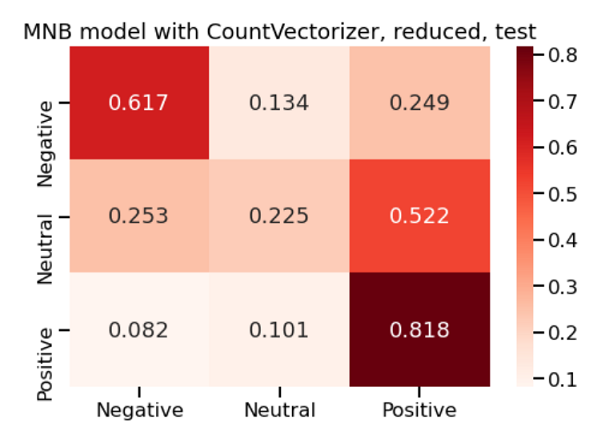
  

Confusion matrix for the final LRCV model:
 

 

> MNB model has a better ability to identify positive reviews but fails miserably to identify neutral reviews. LRCV model has a more balanced performance and is the least over-fitted.

  

# iNterpret

## Feature Importance
 
LRCV full feature set

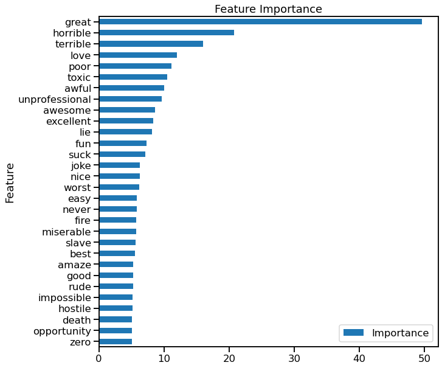

 
LRCV reduced feature set

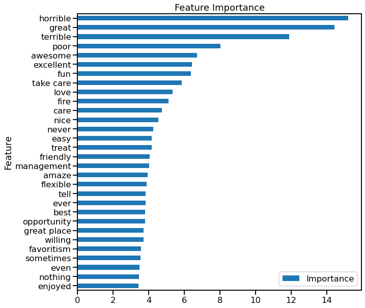

> Both LRCV models (full and reduced feature sets) demonstrate the importance of emotionally charged words like horrible and awesome.

 
MNB reduced feature set

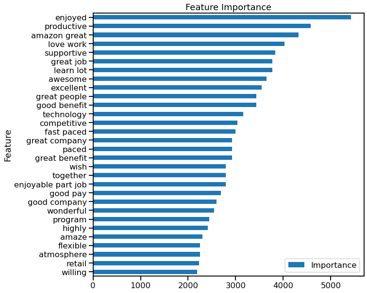

> MNB model feature importance demonstrates the same tendency though it puts more importance on emotionally charged words with positive connotations.

  

# Conclusions and recommendations

## Conclusions

This project had two goals: 
* Developing a predictive classification model of employer review rating
* Gaining insight into factors affecting satisfaction or dissatisfaction of people with their employer.  

The project results are: 

* Two models with relatively good predictive power were built. Both top models were better at predicting positive and negative reviews while predicting neutral reviews appears to be more difficult. 
* Understanding that the most influential factors affecting employees' opinions are a human factor (surrounding people, primarily management) and time.   
* * * 
 
The models: 

* The best performing models are Logistic Regression model and the Multinomial Naive Bayes model. Their performance F1-macro score metrics were 0.55 and 0.56, respectively. The baseline DummyClassifier model has the same metrics at 0.25. The improvement is very prominent.  
* Multinomial Naive Bayes model displayed better performance in identifying positive reviews, while the Logistic Regression model demonstrated a better ability to distinguish between all three classes.  
* Both of the models used reduced wordsets with 406. The reduced word set was used for two reasons: to reduce the overfitting of the models and to minimize computational time. Training an LRCV classifier with the full wordset of 47281 unique words overwhelmed the computational resources and generated an over-fitted model.

  

The Importance of Models' Predictors:    

* Both models identified powerfully emotionally charged words as the best predictors of a class a review belongs to. 
* Words
 1. horrible
 2. terrible
 3. poor
 
 
> are the three most influential predictors of a review belonging to a negative class.

* Words
 1. great
 2. awesome
 3. excellent 
 
> are the three most influential predictors of a review belonging to a positive class.

* That fact makes it challenging to identify neutral reviews correctly. Neutral reviews usually have both trends or none at all. If people don't experience intense emotions, they are less likely to use emotionally charged words.

    * An example of Neutral review with the word 'horrible':
    
    >Had a horrible experience working there. I got sick while working there, took a medical leave to take care of myself after working all through peak season, then got terminated because they are horrible with communication and resolving issues. Would never recommend anyone to work there. 
    
    * While the content of this review seems to be pretty negative, the reviewer rated it as a neutral one  
    
    * An example of a Neutral review  with the word 'excellent':
        >IBM has been a great place for me to learn and grow. The job variety was awesome. This allowed me to make excellent contributions to every team to which I belonged. This opportunity still exists, but is usually in the low cost countries.
    * The content of this review is a positive one, but it has a negative part. It is not related to the company per se but more to a global tendency of shifting jobs overseas.  

* The fact that neutral class reviews are more difficult to identify might also be related to a psychological tendency of people to be polite unless they are agitated. The argument in favor of that theory is that both models misclassify neutral reviews as positive more frequently than misclassify them as negative.
    * The first model identified neutral reviews correctly only in 22.5% of all cases. It misclassified them as positive in 52% of all cases and as negative in 25.3%. 
    * The second model did a better job correctly identifying neutral reviews; it identified them correctly in 40.6% of all cases and misclassified them as positive in 31.2% of the cases and as negative in 28.2% of the cases.
  

The most influential factors affecting employees' opinion of a company:    
* The concept of "time" is broad. Based on the spot check analysis of reviews with the word "time" in the body of a review, it can be in the context of:
        1. a full-/part- time job
        2. time-off
        3. time-management
        4. employee's time with a company
        5. etc.

>It does not appear that word 'time' is more prevalent in any one class, but it does seem to be on people's minds frequently either positively or negatively.
    
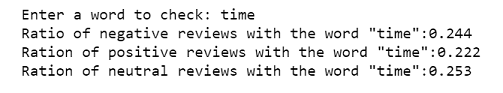

* Words "manage," "management," and "manager" come up in negative reviews almost twice as frequently as in positive reviews. 

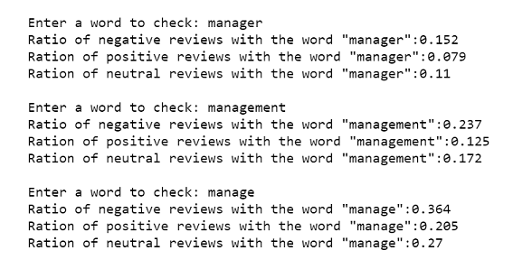

* That implies that if a person has a negative opinion of an employer, it is most probably related to a bad relationship with their manager(s). Even the word "pay" is not as frequent in negative reviews as the words "manager"/"management/"manage" (combined) are.
 While the word "benefit" seemingly affects a negative opinion much less than one could expect, it is more frequent in positive reviews than in negative ones.

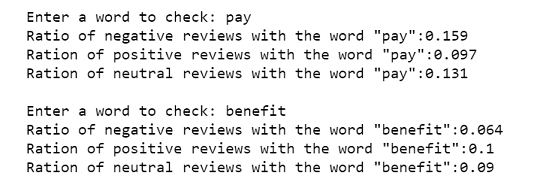

______________________________________________________

 

 
Limitations of the model:  
    
> 1. The built models are relatively simple and, therefore more complex, and ensemble models should be tried and tested. 
    
>    2. Computational resources are a limiting factor in building and testing more complex models. In such cases, Google Colab or Databricks cloud-based resources should be used. There are other alternatives of cloud resources as well that might be worth exploring. 
    
>    3. NLP Multiclass classification models could be necessary in some situations, but they perform worse than binary classification models.
______________________________________________________

  
Suggestion for future improvements:  
    
>    1. Convert the dataset to a binary classification dataset by removing the neutral reviews.  
    
>    2. Another possible strategy is to reduce the original dataset to the records with ratings 1 and 5 only. the argument in favor of that improvement is the most negative and the most positive reviews have the most value for companies; they allow to identify weaknesses and strengths more easily. 
    
>    3. Use unsupervised clustering techniques to assign classes to the full dataset rather than using rating label 

>  4. Explore Theme Extraction and Context Analysis models

  

## Recommendations

1. Test the models built in this project on their internal datasets of employees' open-ended survey answers to a question of their opinion on their group, department, or the company.
2. Make sure that your internal surveys are strictly anonymous and privacy-proof.
3. Implement an auto-alert system to identify negative reviews to address existing problems early.
4. Identification of positive reviews might be a great source of information about groups, departments, and the company's strengths.

 

## Footnote: not all of the files needed to run the code (saved datasets and models) were pushed from the local directory; some of them are omitted due to their size and limited space in the repo.
